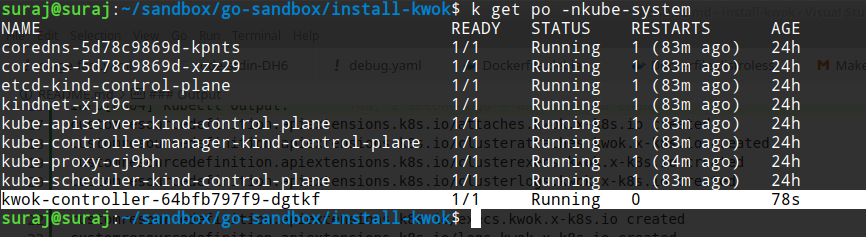

PoC to install [`kwok`](https://github.com/kubernetes-sigs/kwok/) in a cluster using Go.

### How to run
```
$ go run main.go 
```

### Misc
`main.go` is basically a go implementation of `alternative-install.sh`

### Output
```
$ go run main.go 
deploymentAndCRDs URL https://github.com/kubernetes-sigs/kwok/releases/download/v0.4.0/kwok.yaml
INFO[0000] kubectl apply -f https://github.com/kubernetes-sigs/kwok/releases/download/v0.4.0/kwok.yaml 
INFO[0004] kubectl output: 
customresourcedefinition.apiextensions.k8s.io/attaches.kwok.x-k8s.io created
customresourcedefinition.apiextensions.k8s.io/clusterattaches.kwok.x-k8s.io created
customresourcedefinition.apiextensions.k8s.io/clusterexecs.kwok.x-k8s.io created
customresourcedefinition.apiextensions.k8s.io/clusterlogs.kwok.x-k8s.io created
customresourcedefinition.apiextensions.k8s.io/clusterportforwards.kwok.x-k8s.io created
customresourcedefinition.apiextensions.k8s.io/execs.kwok.x-k8s.io created
customresourcedefinition.apiextensions.k8s.io/logs.kwok.x-k8s.io created
customresourcedefinition.apiextensions.k8s.io/metrics.kwok.x-k8s.io created
customresourcedefinition.apiextensions.k8s.io/portforwards.kwok.x-k8s.io created
customresourcedefinition.apiextensions.k8s.io/stages.kwok.x-k8s.io created
serviceaccount/kwok-controller created
clusterrole.rbac.authorization.k8s.io/kwok-controller created
clusterrolebinding.rbac.authorization.k8s.io/kwok-controller created
service/kwok-controller created
deployment.apps/kwok-controller created 
stagesCRs URL https://github.com/kubernetes-sigs/kwok/releases/download/v0.4.0/stage-fast.yaml
INFO[0004] kubectl apply -f https://github.com/kubernetes-sigs/kwok/releases/download/v0.4.0/stage-fast.yaml 
INFO[0006] kubectl output: 
stage.kwok.x-k8s.io/node-heartbeat-with-lease created
stage.kwok.x-k8s.io/node-initialize created
stage.kwok.x-k8s.io/pod-complete created
stage.kwok.x-k8s.io/pod-delete created
stage.kwok.x-k8s.io/pod-ready created 
```

